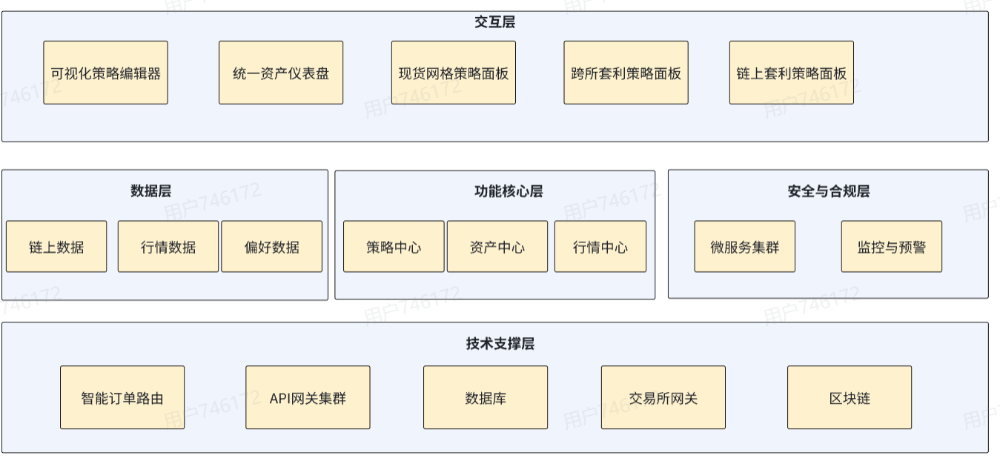

一、团队介绍
@LMX    【李蒙西(3262370263@qq.com)】

@theo   【刘志超（kennyharris@163.com）】

@喻天宇  【hejunlbbc@gmail.com】

@jiaxin 【赖嘉欣( x: @cara_data)】

@Rick(伍韬) 【Rick(伍韬) t.observe@outlook.com】

二、产品简介
CEX内置机器人的核心痛点：
1. 策略单一，适应性差： 策略库单一固化，无法灵活组合以应对复杂多变的市场行情。
2. 资金效率低下： 资金被困在单一交易所，手动进行跨所套利操作繁琐，错失市场机会。
3. 平台割裂，体验不佳： 不同交易所的界面、规则、费率不统一，用户需要付出极高的学习与适应成本。
4. 成本不透明： 除了明面上的交易手续费，还可能存在各种不易察觉的隐性成本。

EasyTrader的差异化解决方案：
1. 智能策略引擎： 提供多样化、可自由组合的高级策略，并支持链上/链下等高级功能，轻松应对复杂市况。
2. 全域资金管理： 通过单一账户统一调度多个CEX的资金，自动执行跨所套利，极大提升资金利用效率。
3. 统一极简体验： 网页端即开即用，提供直观的零代码操作界面，大幅降低使用门槛，让小白也能轻松上手专业交易。
4. 安全与成本透明： 用户资产自持，杜绝托管风险；系统自动寻找最优费率，确保成本清晰可控。

三、技术架构
1. 总体设计
EasyTrader 采用前后端分离架构，基于 Rust + Next.js + PostgreSQL 技术栈构建，结合以太坊主网及 Uniswap V3 协议，实现高性能的去中心化网格交易系统。系统通过异步任务调度、实时行情订阅与自动化交易执行，实现“买低卖高”的智能策略。
整体架构分为三层：
- 前端交互层
- 后端逻辑层
- 数据存储层
2. 前端 (Next.js 15 + TypeScript)
前端采用 Next.js 15 框架和 TypeScript 编写，主要负责：
- 策略参数配置：用户可设定网格区间（上/下限）、格子数量与总投入金额；
- 实时状态监控：通过 WebSocket 连接实时展示订单状态、资产概览、价格变化；
- 用户界面优化：响应式设计，兼容桌面端与移动端，确保流畅交互体验；
- 控制面板功能：提供策略启动、暂停、停止等控制入口。
3. 后端 (Rust + Tokio 异步框架)
后端以 Rust 为核心语言，结合 Tokio 异步运行时实现高并发与低延迟处理，模块划分如下：
（1）策略引擎
- 实现自动化 网格算法，根据设定的价格区间与网格数量动态生成买卖点；
- 持续监控市场价格变化，自动触发挂单或成交操作；
- 支持多费率池（0.05%、0.3%、1%）的 Uniswap V3 集成，实现最优流动性利用。
（2）交易所网关
- 稳定对接 Uniswap V3 及其他 DEX API；
- 处理身份认证、链上交易签名与订单提交；
- 可扩展对接 Binance、SushiSwap、1inch 等多交易所接口。
（3）监控与日志模块
- 实时记录策略执行日志；
- 监控系统性能与交易延迟；
- 支持异常告警和运行状态可视化。
4. 数据存储层 (PostgreSQL)
系统采用 PostgreSQL 作为核心数据库，负责：
- 存储交易策略、订单、用户参数与市场数据；
- 提供连接池与自动建表机制；
- 支持高并发查询与数据持久化；
- 可扩展日志与分析表，为后续收益分析与回测功能提供数据支撑。

---
5. 数据流与通信机制
- 行情推送：使用 WebSocket 实现实时行情与订单状态同步；
- API 通信：前后端通过 RESTful API 进行策略控制（启动、停止、状态查询）；
- 链上交互：后端通过以太坊 RPC 接口与 Uniswap V3 智能合约通信，实时更新交易信息。
6. 系统特性
暂时无法在飞书文档外展示此内容
数据流：使用WebSocket进行实时行情推送，实现快速自动交易。
[图片]
四、商业模式与未来规划
暂时无法在飞书文档外展示此内容
目标客群
初级投资者：寻求简单、省心的自动化投资工具，希望使用预设模板。
高级交易员：需要高性能执行和复杂参数定制能力，以实施个性化策略。
收入模式
Freemium（免费增值）模式 ：基础网格策略永久免费，吸引用户入门。
订阅收费：高级功能（如跨交易所套利、AI参数优化、马丁策略等）按月/年订阅收费。
迭代思路
现货网格 → 主流策略 → AI智能化 →策略市场
未来增强模块：智能数据分析
本系统计划引入 Alpha Vantage MCP 模块(https://mcp.alphavantage.co/?utm_source=mcp.so&utm_medium=referral&utm_campaign=202508&utm_id=000001&utm_term=web_project&utm_content=v2)，用于获取加密货币与宏观经济数据，包括 RSI、MACD、BBANDS、ATR 等几十项技术指标，以及 CPI、失业率、国债收益率等宏观经济指标。
支持主流数字资产（如 BTC、DOGE 等）及经济指标同时分析。
通过指标组合计算趋势分数、风险分数，并识别买入/卖出信号、关键支撑/阻力位。
策略引擎将依据洞察自动调整网格区间、格子数、仓位上限、止盈止损机制。
以“数据驱动网格交易”为目标，使系统从规则驱动走向智能决策。

